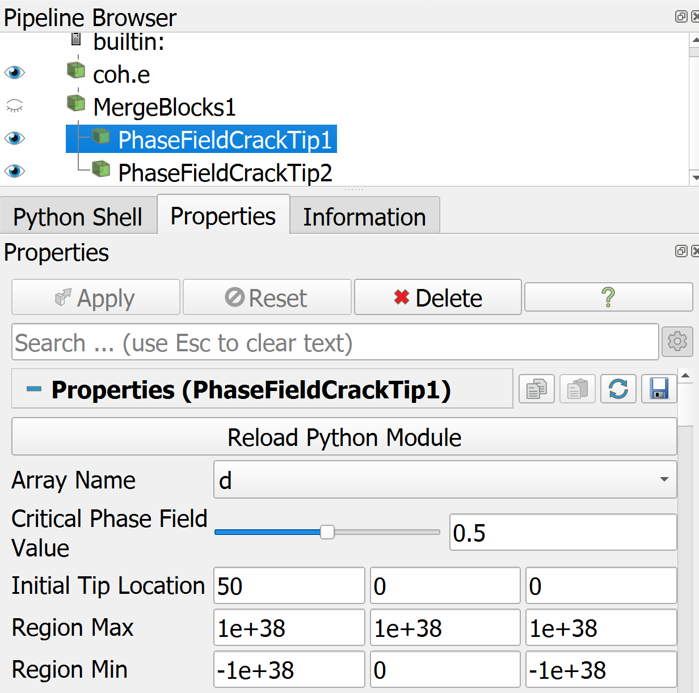

# PVFilters

`PVFilters` is a collection of custom ParaView filters designed to extend the capabilities of the ParaView visualization tool. This repository includes various filters for scientific computing and data visualization, particularly focusing on finite element methods and phase field crack tip detection.

## Filters

### `PDcracktip`: Phase Field Crack Tip

The `PDcracktip` filter is used to find the crack tip location based on phase field values in a dataset and the distance to the initial tip. It allows users to define a critical phase field value and select regions of interest for more precise analysis.

#### Features

- **Critical Phase Field Value**: Define the threshold for phase field values to identify crack tips.
- **Initial Tip Location**: Specify the initial crack tip location.
- **Region Selection**: Define a region of interest using minimum and maximum coordinates to filter points within a specific area, so that we use this filter for multiple cracks.

#### Usage

To use the `PDcracktip` filter in ParaView, follow these steps:

1. **Load your dataset into ParaView**

2. **Apply the `MergeBlocks` filter** to combine your dataset into a single `vtkUnstructuredGrid`

3. **Apply the `PDcracktip` filter**

4. **Set the parameters**:
   - `ArrayName`: Select the phase field array name from the list of available arrays.
   - `CriticalPhaseFieldValue`: Set the threshold value for the phase field (between 0 and 1).
   - `InitialTipLocation`: Set the initial guess for the crack tip location.
   - `RegionMin` and `RegionMax`: Define the region of interest for filtering points.
   
   Example:
   

5. **Update the pipeline and render the results**:
   

